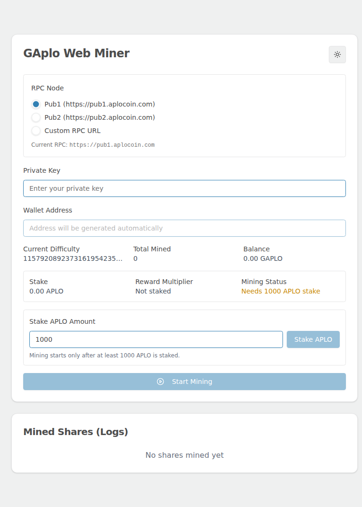
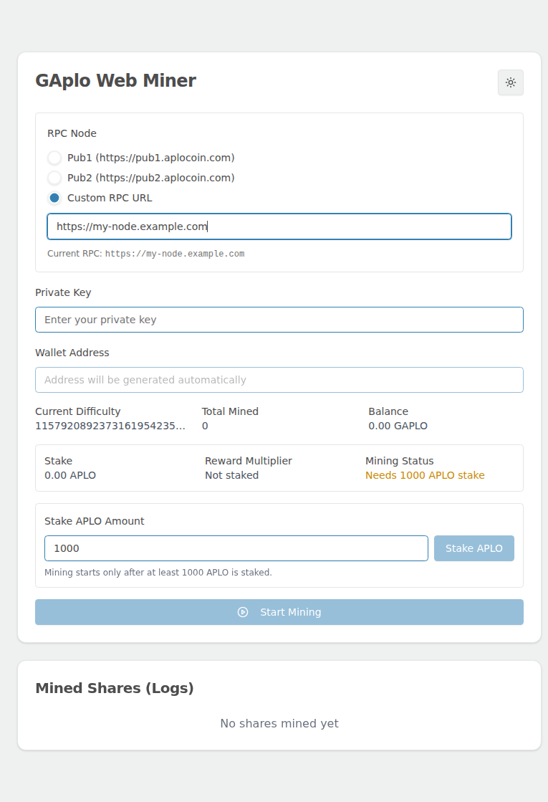
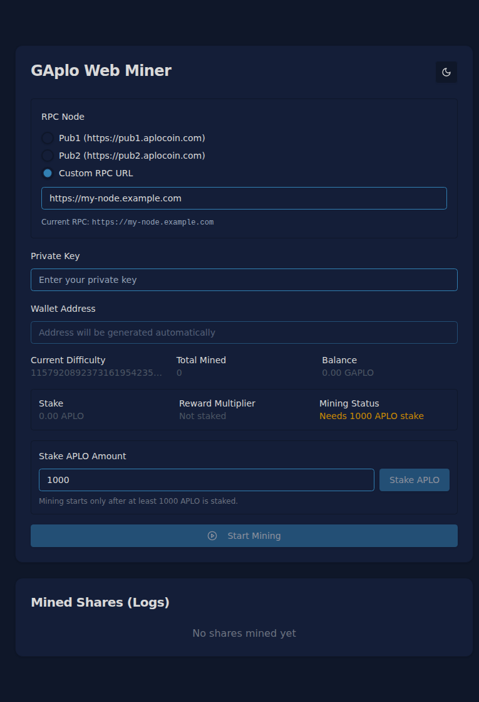

# GAplo Web Miner

Browser-based GAplo/APLO miner built with Next.js, TypeScript, Web3.js and Tailwind CSS.

## Features

- Browser mining with locally signed transactions.
- APLO staking controls and staking status/multiplier display.
- RPC node selector: Pub1, Pub2, or a user-defined custom HTTP/HTTPS RPC URL.
- Selected RPC settings are saved in the browser and reused on the next visit.
- Mining stops automatically before switching RPC nodes so Web3 and contract instances are recreated cleanly.
- Live balance, difficulty, total mined, stake and mined-share log UI.
- Light/dark theme switcher.

## Screenshots

### Main interface



### Custom RPC node selection



### Dark mode



## RPC node configuration

The app no longer uses a single hardcoded RPC endpoint. In the **RPC Node** panel you can choose:

| Option | URL |
| --- | --- |
| Pub1 | `https://pub1.aplocoin.com` |
| Pub2 | `https://pub2.aplocoin.com` |
| Custom RPC URL | Any valid `http://` or `https://` RPC endpoint |

When a custom URL is selected, enter the node URL in the input field. The active endpoint is shown under **Current RPC**.

## Requirements

- Node.js 20+
- npm
- A valid Aplo private key
- APLO/GAPLO balance for staking and gas
- At least `1000 APLO` staked before mining starts

## Local development

```bash
npm install
npm run dev
```

Open http://localhost:3000.

## Static production build

This project is configured with `output: 'export'`, so `npm run build` creates static files in `out/`.

```bash
npm install
npm run build
npx serve -s out -l 3000
```

Open http://localhost:3000.

## Docker

### Docker Compose

```bash
docker compose up --build -d
```

Open http://localhost:3000.

Stop it with:

```bash
docker compose down
```

### Docker CLI

```bash
docker build -t aplo-webminer .
docker run -d --name aplo-webminer -p 3000:3000 aplo-webminer
```

Stop/remove:

```bash
docker stop aplo-webminer
docker rm aplo-webminer
```

## Usage

1. Select **Pub1**, **Pub2**, or **Custom RPC URL**.
2. If using a custom node, enter a valid HTTP/HTTPS RPC endpoint.
3. Enter a private key. The wallet address is derived automatically in the browser.
4. Stake APLO if the wallet has less than the required minimum stake.
5. Click **Start Mining**.
6. Watch stats and mined shares in the log table.

## Security notes

- The private key is used only in the browser for local signing.
- Do not share your private key.
- Prefer a dedicated mining wallet with limited funds.
- Verify custom RPC URLs before using them.

## Contract addresses

- Mining contract: `0x0000000000000000000000000000000000001234`
- Staking contract: `0x0000000000000000000000000000000000001235`

## Troubleshooting

### Mining does not start

- Check that the selected RPC node is reachable.
- Verify the private key format: 64 hex characters, with or without `0x`.
- Make sure the wallet has enough GAPLO for gas.
- Make sure at least `1000 APLO` is staked.
- Wait for the 20-block cooldown between mining attempts.

### Custom RPC is not applied

- The URL must start with `http://` or `https://`.
- The current active endpoint is shown below the RPC selector.
- If mining is running, changing nodes stops mining first and then recreates Web3 connections.
